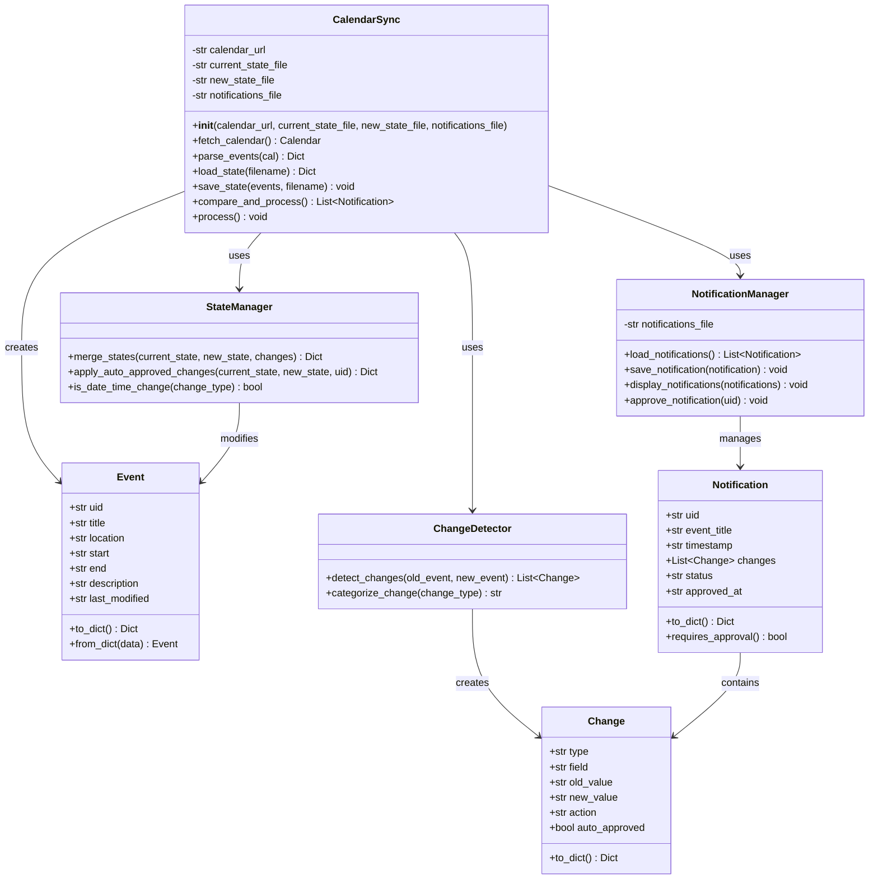
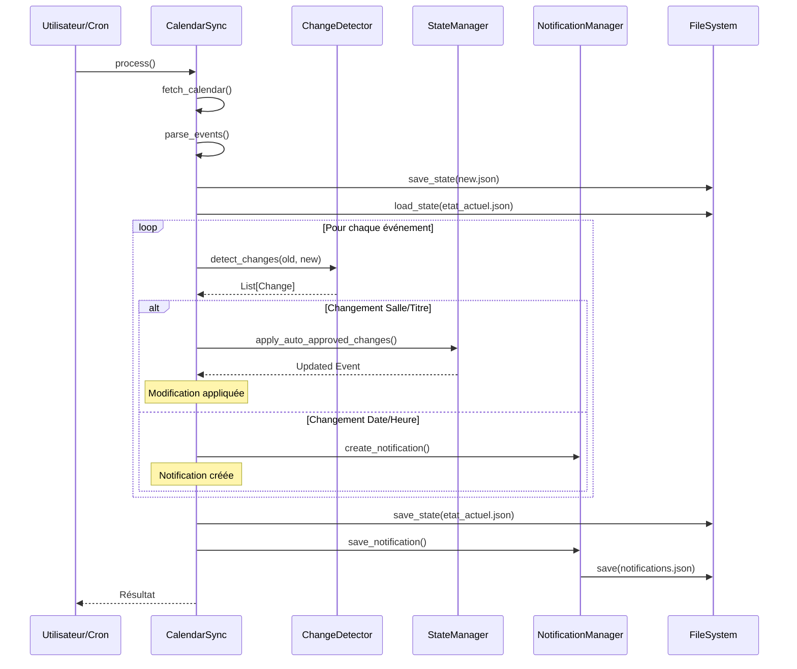

# Système de Gestion et Synchronisation de Calendrier iCal

## Énoncé du Projet

Développer un système automatisé de surveillance et de synchronisation d'un calendrier iCal distant. Le système doit télécharger périodiquement le calendrier, détecter les modifications, appliquer automatiquement certains changements selon des règles métier, et générer des notifications pour les modifications nécessitant une validation manuelle.

## Spécifications Fonctionnelles

### 1. Objectifs

- **Synchronisation automatique** : Télécharger et parser un calendrier iCal depuis une URL webcal
- **Détection intelligente des modifications** : Comparer l'état actuel avec l'état précédent
- **Application sélective des changements** : Appliquer automatiquement certaines modifications
- **Système de notifications** : Alerter sur les modifications nécessitant une approbation

### 2. Règles Métier

#### 2.1 Modifications Auto-approuvées (Appliquées automatiquement)
- ✅ **Changement de salle** : La modification est acceptée et appliquée
- ✅ **Changement de titre** : La modification est acceptée et appliquée

#### 2.2 Modifications Nécessitant Approbation (Notifications générées)
- ⚠️ **Changement de date de début** : Notification créée, modification en attente
- ⚠️ **Changement d'heure de début** : Notification créée, modification en attente
- ⚠️ **Changement de date de fin** : Notification créée, modification en attente
- ⚠️ **Changement d'heure de fin** : Notification créée, modification en attente

### 3. Gestion des Fichiers

| Fichier | Description | Contenu |
|---------|-------------|---------|
| `etat_actuel.json` | État validé du calendrier | Dernier état traité et approuvé |
| `new.json` | Nouvel état téléchargé | État du calendrier depuis la source |
| `notifications.json` | Journal des notifications | Historique de toutes les modifications détectées |

### 4. Cycle de Traitement

```
1. Téléchargement du calendrier iCal
2. Parsing et extraction des événements
3. Sauvegarde dans new.json
4. Comparaison avec etat_actuel.json
5. Application des règles métier
6. Génération des notifications
7. Mise à jour de etat_actuel.json (sauf dates/heures en attente)
8. Sauvegarde des notifications
```

## Diagramme de Classes



## Diagramme de Séquence



## Architecture des Données

### Structure Event (JSON)

```json
{
  "uid": "event-12345@example.com",
  "title": "Cours de Mathématiques",
  "location": "Salle A101",
  "start": "2024-01-15T09:00:00",
  "end": "2024-01-15T11:00:00",
  "description": "Algèbre linéaire",
  "last_modified": "2024-01-10T14:30:00"
}
```

### Structure Notification (JSON)

```json
{
  "uid": "event-12345@example.com",
  "event_title": "Cours de Mathématiques",
  "timestamp": "2024-01-10T14:30:00",
  "changes": [
    {
      "type": "start_time_change",
      "field": "Date/Heure de début",
      "old_value": "2024-01-15T09:00:00",
      "new_value": "2024-01-15T10:00:00",
      "action": "require_approval",
      "auto_approved": false
    }
  ],
  "status": "pending",
  "approved_at": null
}
```

---

# Code Python Adapté

```python
import requests
from icalendar import Calendar
import json
from datetime import datetime
import os
from typing import Dict, List, Optional
from dataclasses import dataclass, asdict
from enum import Enum

class ChangeType(Enum):
    """Types de changements détectables"""
    TITLE = "title_change"
    LOCATION = "location_change"
    START_TIME = "start_time_change"
    END_TIME = "end_time_change"
    NEW_EVENT = "new_event"
    DELETED_EVENT = "deleted_event"

class ActionType(Enum):
    """Types d'actions à effectuer"""
    AUTO_APPROVED = "auto_approved"
    REQUIRE_APPROVAL = "require_approval"
    NOTIFICATION = "notification"

@dataclass
class Change:
    """Représente un changement détecté"""
    type: str
    field: str
    old_value: Optional[str]
    new_value: Optional[str]
    action: str
    auto_approved: bool

    def to_dict(self) -> Dict:
        return asdict(self)

@dataclass
class Event:
    """Représente un événement du calendrier"""
    uid: str
    title: str
    location: str
    start: str
    end: str
    description: str
    last_modified: str

    def to_dict(self) -> Dict:
        return asdict(self)

    @classmethod
    def from_dict(cls, data: Dict) -> 'Event':
        return cls(**data)

class ChangeDetector:
    """Détecte et catégorise les changements entre deux événements"""
    
    # Règles métier : définit quels changements sont auto-approuvés
    AUTO_APPROVED_CHANGES = {
        ChangeType.TITLE,
        ChangeType.LOCATION
    }
    
    REQUIRE_APPROVAL_CHANGES = {
        ChangeType.START_TIME,
        ChangeType.END_TIME
    }

    @staticmethod
    def detect_changes(old_event: Dict, new_event: Dict) -> List[Change]:
        """Détecte tous les changements entre deux versions d'un événement"""
        changes = []
        
        # Changement de titre (auto-approuvé)
        if old_event['title'] != new_event['title']:
            changes.append(Change(
                type=ChangeType.TITLE.value,
                field="Titre",
                old_value=old_event['title'],
                new_value=new_event['title'],
                action=ActionType.AUTO_APPROVED.value,
                auto_approved=True
            ))
        
        # Changement de salle (auto-approuvé)
        if old_event['location'] != new_event['location']:
            changes.append(Change(
                type=ChangeType.LOCATION.value,
                field="Salle",
                old_value=old_event['location'],
                new_value=new_event['location'],
                action=ActionType.AUTO_APPROVED.value,
                auto_approved=True
            ))
        
        # Changement d'heure/date de début (nécessite approbation)
        if old_event['start'] != new_event['start']:
            changes.append(Change(
                type=ChangeType.START_TIME.value,
                field="Date/Heure de début",
                old_value=old_event['start'],
                new_value=new_event['start'],
                action=ActionType.REQUIRE_APPROVAL.value,
                auto_approved=False
            ))
        
        # Changement d'heure/date de fin (nécessite approbation)
        if old_event['end'] != new_event['end']:
            changes.append(Change(
                type=ChangeType.END_TIME.value,
                field="Date/Heure de fin",
                old_value=old_event['end'],
                new_value=new_event['end'],
                action=ActionType.REQUIRE_APPROVAL.value,
                auto_approved=False
            ))
        
        return changes

class StateManager:
    """Gère les états du calendrier et applique les modifications"""
    
    @staticmethod
    def apply_auto_approved_changes(current_event: Dict, new_event: Dict, 
                                    changes: List[Change]) -> Dict:
        """
        Applique les changements auto-approuvés à l'état actuel.
        Les changements de date/heure ne sont PAS appliqués.
        """
        updated_event = current_event.copy()
        
        for change in changes:
            if change.auto_approved:
                if change.type == ChangeType.TITLE.value:
                    updated_event['title'] = new_event['title']
                elif change.type == ChangeType.LOCATION.value:
                    updated_event['location'] = new_event['location']
                # Les changements de date/heure ne sont jamais appliqués ici
        
        updated_event['last_modified'] = datetime.now().isoformat()
        return updated_event
    
    @staticmethod
    def is_date_time_change(change_type: str) -> bool:
        """Vérifie si le changement concerne une date/heure"""
        return change_type in [
            ChangeType.START_TIME.value,
            ChangeType.END_TIME.value
        ]

class NotificationManager:
    """Gère les notifications"""
    
    def __init__(self, notifications_file: str):
        self.notifications_file = notifications_file
    
    def load_notifications(self) -> List[Dict]:
        """Charge les notifications existantes"""
        if os.path.exists(self.notifications_file):
            try:
                with open(self.notifications_file, 'r', encoding='utf-8') as f:
                    return json.load(f)
            except Exception as e:
                print(f"⚠️ Erreur lors de la lecture des notifications: {e}")
                return []
        return []
    
    def save_notification(self, notification: Dict):
        """Sauvegarde une nouvelle notification"""
        notifications = self.load_notifications()
        notifications.append(notification)
        
        with open(self.notifications_file, 'w', encoding='utf-8') as f:
            json.dump(notifications, f, indent=2, ensure_ascii=False)
    
    def display_notifications(self, notifications: List[Dict]):
        """Affiche les notifications de manière lisible"""
        if not notifications:
            print("✓ Aucune notification générée")
            return
        
        print(f"\n{'='*80}")
        print(f"📢 NOTIFICATIONS ({len(notifications)} changement(s) détecté(s))")
        print(f"{'='*80}\n")
        
        for i, notif in enumerate(notifications, 1):
            print(f"[{i}] Événement: {notif['event_title']}")
            print(f"    UID: {notif['uid']}")
            print(f"    Date: {notif['timestamp']}")
            print(f"    Statut: {notif['status']}")
            
            for change in notif['changes']:
                if change['auto_approved']:
                    symbol = "✅ APPLIQUÉ"
                else:
                    symbol = "⚠️ EN ATTENTE"
                
                print(f"    {symbol} {change['field']}:")
                if change['old_value']:
                    print(f"       Ancien: {change['old_value']}")
                if change['new_value']:
                    print(f"       Nouveau: {change['new_value']}")
                print(f"       Action: {change['action']}")
            print()
    
    def approve_notification(self, uid: str) -> bool:
        """Approuve manuellement une notification et applique les changements"""
        notifications = self.load_notifications()
        modified = False
        
        for notif in notifications:
            if notif['uid'] == uid and notif['status'] == 'pending':
                for change in notif['changes']:
                    if change['action'] == ActionType.REQUIRE_APPROVAL.value:
                        change['auto_approved'] = True
                notif['status'] = 'approved'
                notif['approved_at'] = datetime.now().isoformat()
                modified = True
        
        if modified:
            with open(self.notifications_file, 'w', encoding='utf-8') as f:
                json.dump(notifications, f, indent=2, ensure_ascii=False)
            print(f"✅ Notification {uid} approuvée")
            return True
        else:
            print(f"⚠️ Notification {uid} non trouvée ou déjà approuvée")
            return False

class CalendarSync:
    """Classe principale de synchronisation du calendrier"""
    
    def __init__(self, calendar_url: str, 
                 current_state_file: str = "etat_actuel.json",
                 new_state_file: str = "new.json",
                 notifications_file: str = "notifications.json"):
        """
        Initialise le système de synchronisation
        
        Args:
            calendar_url: URL du calendrier iCal (webcal:// ou https://)
            current_state_file: Fichier de l'état actuel validé
            new_state_file: Fichier du nouvel état téléchargé
            notifications_file: Fichier des notifications
        """
        self.calendar_url = calendar_url.replace("webcal://", "https://")
        self.current_state_file = current_state_file
        self.new_state_file = new_state_file
        self.notifications_file = notifications_file
        
        self.change_detector = ChangeDetector()
        self.state_manager = StateManager()
        self.notification_manager = NotificationManager(notifications_file)
    
    def fetch_calendar(self) -> Calendar:
        """Télécharge et parse le calendrier iCal"""
        try:
            print("📥 Téléchargement du calendrier...")
            response = requests.get(self.calendar_url, timeout=30)
            response.raise_for_status()
            print("✓ Calendrier téléchargé avec succès")
            return Calendar.from_ical(response.content)
        except requests.exceptions.RequestException as e:
            print(f"❌ Erreur lors du téléchargement du calendrier: {e}")
            raise
        except Exception as e:
            print(f"❌ Erreur lors du parsing du calendrier: {e}")
            raise
    
    def parse_events(self, cal: Calendar) -> Dict[str, Dict]:
        """Parse les événements du calendrier"""
        events = {}
        
        for component in cal.walk():
            if component.name == "VEVENT":
                uid = str(component.get('uid'))
                
                # Gestion des dates/heures
                start_dt = component.get('dtstart')
                end_dt = component.get('dtend')
                
                event_data = {
                    'uid': uid,
                    'title': str(component.get('summary', '')),
                    'location': str(component.get('location', '')),
                    'start': start_dt.dt.isoformat() if start_dt else None,
                    'end': end_dt.dt.isoformat() if end_dt else None,
                    'description': str(component.get('description', '')),
                    'last_modified': datetime.now().isoformat()
                }
                
                events[uid] = event_data
        
        return events
    
    def load_state(self, filename: str) -> Dict[str, Dict]:
        """Charge l'état depuis un fichier JSON"""
        if os.path.exists(filename):
            try:
                with open(filename, 'r', encoding='utf-8') as f:
                    return json.load(f)
            except Exception as e:
                print(f"⚠️ Erreur lors de la lecture de {filename}: {e}")
                return {}
        return {}
    
    def save_state(self, events: Dict[str, Dict], filename: str):
        """Sauvegarde l'état dans un fichier JSON"""
        with open(filename, 'w', encoding='utf-8') as f:
            json.dump(events, f, indent=2, ensure_ascii=False)
    
    def compare_and_process(self) -> List[Dict]:
        """
        Compare les états et traite les changements selon les règles métier
        
        Returns:
            Liste des notifications générées
        """
        current_state = self.load_state(self.current_state_file)
        new_state = self.load_state(self.new_state_file)
        
        notifications = []
        updated_current_state = current_state.copy()
        
        # Traiter les événements modifiés ou existants
        for uid, new_event in new_state.items():
            if uid in current_state:
                old_event = current_state[uid]
                changes = self.change_detector.detect_changes(old_event, new_event)
                
                if changes:
                    # Séparer les changements auto-approuvés et ceux nécessitant approbation
                    auto_approved_changes = [c for c in changes if c.auto_approved]
                    require_approval_changes = [c for c in changes if not c.auto_approved]
                    
                    # Appliquer les changements auto-approuvés (salle, titre)
                    if auto_approved_changes:
                        updated_current_state[uid] = self.state_manager.apply_auto_approved_changes(
                            current_state[uid], new_event, auto_approved_changes
                        )
                    
                    # Créer une notification pour TOUS les changements
                    notification = {
                        'uid': uid,
                        'event_title': new_event['title'],
                        'timestamp': datetime.now().isoformat(),
                        'changes': [c.to_dict() for c in changes],
                        'status': 'pending' if require_approval_changes else 'applied',
                        'approved_at': None if require_approval_changes else datetime.now().isoformat()
                    }
                    notifications.append(notification)
            else:
                # Nouvel événement - ajouté automatiquement
                updated_current_state[uid] = new_event
                notification = {
                    'uid': uid,
                    'event_title': new_event['title'],
                    'timestamp': datetime.now().isoformat(),
                    'changes': [{
                        'type': ChangeType.NEW_EVENT.value,
                        'field': 'Nouvel événement',
                        'old_value': None,
                        'new_value': 'Événement créé',
                        'action': ActionType.AUTO_APPROVED.value,
                        'auto_approved': True
                    }],
                    'status': 'applied',
                    'approved_at': datetime.now().isoformat()
                }
                notifications.append(notification)
        
        # Traiter les événements supprimés
        for uid in set(current_state.keys()) - set(new_state.keys()):
            del updated_current_state[uid]
            notification = {
                'uid': uid,
                'event_title': current_state[uid]['title'],
                'timestamp': datetime.now().isoformat(),
                'changes': [{
                    'type': ChangeType.DELETED_EVENT.value,
                    'field': 'Événement supprimé',
                    'old_value': current_state[uid]['title'],
                    'new_value': None,
                    'action': ActionType.NOTIFICATION.value,
                    'auto_approved': None
                }],
                'status': 'deleted',
                'approved_at': datetime.now().isoformat()
            }
            notifications.append(notification)
        
        # Sauvegarder l'état actuel mis à jour (avec changements auto-approuvés seulement)
        self.save_state(updated_current_state, self.current_state_file)
        
        return notifications
    
    def process(self):
        """Processus principal de synchronisation"""
        print("\n" + "="*80)
        print("🔄 SYNCHRONISATION DU CALENDRIER")
        print("="*80 + "\n")
        
        try:
            # Étape 1 : Télécharger et parser
            cal = self.fetch_calendar()
            
            # Étape 2 : Extraire les événements
            print("📊 Analyse des événements...")
            new_events = self.parse_events(cal)
            print(f"✓ {len(new_events)} événement(s) trouvé(s)")
            
            # Étape 3 : Sauvegarder le nouvel état
            print(f"💾 Sauvegarde dans {self.new_state_file}...")
            self.save_state(new_events, self.new_state_file)
            
            # Étape 4 : Charger l'état actuel
            print(f"📂 Chargement de {self.current_state_file}...")
            current_state = self.load_state(self.current_state_file)
            print(f"✓ {len(current_state)} événement(s) dans l'état actuel")
            
            # Étape 5 : Comparer et traiter
            print("\n🔍 Comparaison et traitement des changements...")
            notifications = self.compare_and_process()
            
            # Étape 6 : Sauvegarder les notifications
            if notifications:
                print(f"\n📝 {len(notifications)} notification(s) générée(s)")
                for notif in notifications:
                    self.notification_manager.save_notification(notif)
                
                self.notification_manager.display_notifications(notifications)
            else:
                print("\n✓ Aucun changement détecté")
            
            # Résumé
            print("\n" + "="*80)
            print("✅ SYNCHRONISATION TERMINÉE")
            print("="*80)
            print(f"📁 État actuel: {self.current_state_file}")
            print(f"📁 Nouvel état: {self.new_state_file}")
            print(f"📁 Notifications: {self.notifications_file}")
            print()
            
            return notifications
            
        except Exception as e:
            print(f"\n❌ ERREUR: {e}")
            raise

# Fonctions utilitaires
def approve_notification_by_uid(uid: str, notifications_file: str = "notifications.json",
                                current_state_file: str = "etat_actuel.json",
                                new_state_file: str = "new.json"):
    """
    Approuve manuellement une notification et applique les changements de date/heure
    
    Args:
        uid: UID de l'événement à approuver
        notifications_file: Fichier des notifications
        current_state_file: Fichier de l'état actuel
        new_state_file: Fichier du nouvel état
    """
    # Approuver la notification
    nm = NotificationManager(notifications_file)
    if not nm.approve_notification(uid):
        return False
    
    # Appliquer les changements de date/heure
    current_state = {}
    new_state = {}
    
    if os.path.exists(current_state_file):
        with open(current_state_file, 'r', encoding='utf-8') as f:
            current_state = json.load(f)
    
    if os.path.exists(new_state_file):
        with open(new_state_file, 'r', encoding='utf-8') as f:
            new_state = json.load(f)
    
    if uid in current_state and uid in new_state:
        # Appliquer les changements de date/heure
        current_state[uid]['start'] = new_state[uid]['start']
        current_state[uid]['end'] = new_state[uid]['end']
        current_state[uid]['last_modified'] = datetime.now().isoformat()
        
        with open(current_state_file, 'w', encoding='utf-8') as f:
            json.dump(current_state, f, indent=2, ensure_ascii=False)
        
        print(f"✅ Changements de date/heure appliqués pour l'événement {uid}")
        return True
    
    return False

def list_pending_notifications(notifications_file: str = "notifications.json"):
    """Liste toutes les notifications en attente d'approbation"""
    nm = NotificationManager(notifications_file)
    notifications = nm.load_notifications()
    
    pending = [n for n in notifications if n['status'] == 'pending']
    
    if not pending:
        print("✓ Aucune notification en attente")
        return
    
    print(f"\n⚠️ {len(pending)} notification(s) en attente d'approbation:\n")
    
    for i, notif in enumerate(pending, 1):
        print(f"[{i}] {notif['event_title']}")
        print(f"    UID: {notif['uid']}")
        print(f"    Date: {notif['timestamp']}")
        
        for change in notif['changes']:
            if not change['auto_approved']:
                print(f"    - {change['field']}: {change['old_value']} → {change['new_value']}")
        print()

# Point d'entrée principal
if __name__ == "__main__":
    # Configuration
    CALENDAR_URL = "webcal://<your_url>"
    
    # Créer et exécuter la synchronisation
    sync = CalendarSync(
        calendar_url=CALENDAR_URL,
        current_state_file="etat_actuel.json",
        new_state_file="new.json",
        notifications_file="notifications.json"
    )
    
    try:
        notifications = sync.process()
        
        # Afficher les notifications en attente
        print("\n" + "-"*80)
        list_pending_notifications()
        
        # Exemple d'approbation
        # if notifications:
        #     # Approuver la première notification en attente
        #     pending = [n for n in notifications if n['status'] == 'pending']
        #     if pending:
        #         uid_to_approve = pending[0]['uid']
        #         print(f"\n📝 Exemple d'approbation pour l'événement {uid_to_approve}")
        #         approve_notification_by_uid(uid_to_approve)
        
    except Exception as e:
        print(f"❌ Erreur fatale: {e}")
        exit(1)
```

## Utilisation

### 1. Installation des dépendances

```bash
pip install icalendar requests
```

### 2. Configuration avec Google Calendar

1. Ouvrir [Google Calendar](https://calendar.google.com)
2. Cliquer sur ⚙️ **Paramètres** → **Paramètres**
3. Dans la colonne gauche, sélectionner le calendrier souhaité
4. Faire défiler jusqu'à **Intégrer le calendrier**
5. Copier l'**Adresse secrète au format iCal**

Configurer l'URL dans le script :

```python
CALENDAR_URL = "https://calendar.google.com/calendar/ical/votre_email%40gmail.com/private-abc123/basic.ics"
```

### 3. Exécution manuelle

```bash
python calendar_sync.py
```

### 4. Approuver une notification

```python
from calendar_sync import approve_notification_by_uid, list_pending_notifications

# Lister les notifications en attente
list_pending_notifications()

# Approuver une notification spécifique
approve_notification_by_uid("event-uid-12345")
```

### 5. Automatisation (Cron)

```bash
# Synchroniser toutes les heures
0 * * * * /usr/bin/python3 /path/to/calendar_sync.py >> /var/log/calendar_sync.log 2>&1
```

## Fichiers générés

- `etat_actuel.json` : État validé du calendrier
- `new.json` : Dernier état téléchargé
- `notifications.json` : Historique des notifications

## Travail à faire

1. **Code review** : Effectuer une revue de code complète et produire un document `code_review.md` argumenté analysant la qualité, la maintenabilité et les éventuelles améliorations du code.

2. **Approbation pour ajout/suppression** : Modifier le programme pour qu'un ajout ou une suppression d'événement déclenche une notification nécessitant une approbation manuelle (au lieu d'être appliqué automatiquement).

3. **Date limite d'analyse** : Ajouter un paramètre de configuration permettant de définir une date limite avant laquelle les événements ne sont pas analysés (pour ignorer les événements passés).