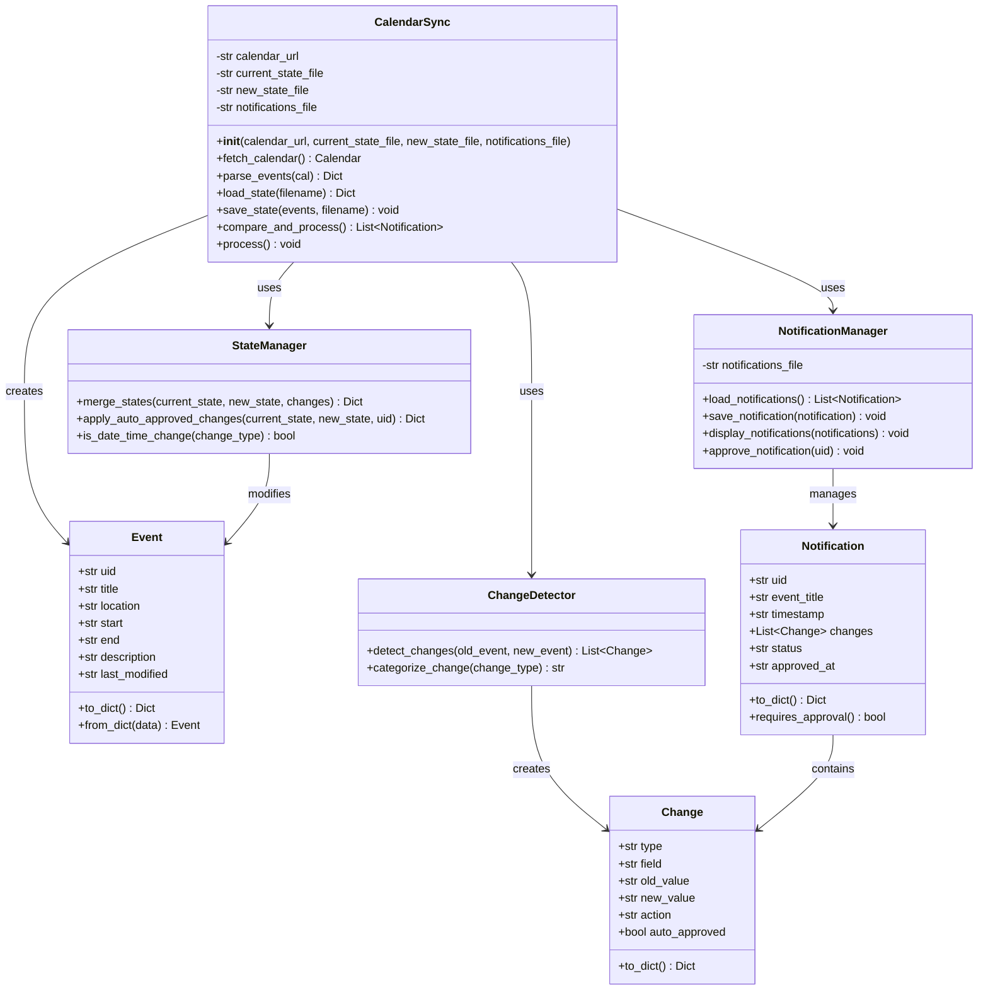
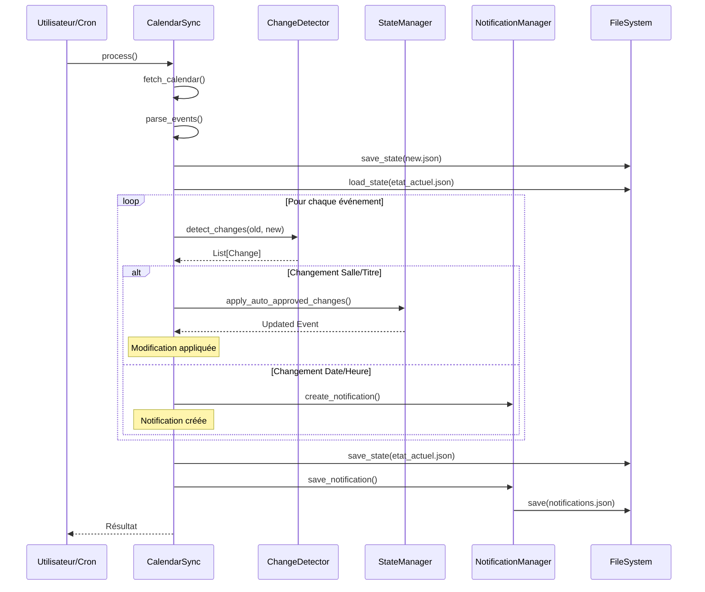

# Système de Gestion et Synchronisation de Calendrier iCal

## Énoncé du Projet

Développer un système automatisé de surveillance et de synchronisation d'un calendrier iCal distant. Le système doit télécharger périodiquement le calendrier, détecter les modifications, appliquer automatiquement certains changements selon des règles métier, et générer des notifications pour les modifications nécessitant une validation manuelle.

## Spécifications Fonctionnelles

### 1. Objectifs

- **Synchronisation automatique** : Télécharger et parser un calendrier iCal depuis une URL webcal
- **Détection intelligente des modifications** : Comparer l'état actuel avec l'état précédent
- **Application sélective des changements** : Appliquer automatiquement certaines modifications
- **Système de notifications** : Alerter sur les modifications nécessitant une approbation

### 2. Règles Métier

#### 2.1 Modifications Auto-approuvées (Appliquées automatiquement)
- ✅ **Changement de salle** : La modification est acceptée et appliquée
- ✅ **Changement de titre** : La modification est acceptée et appliquée

#### 2.2 Modifications Nécessitant Approbation (Notifications générées)
- ⚠️ **Changement de date de début** : Notification créée, modification en attente
- ⚠️ **Changement d'heure de début** : Notification créée, modification en attente
- ⚠️ **Changement de date de fin** : Notification créée, modification en attente
- ⚠️ **Changement d'heure de fin** : Notification créée, modification en attente

### 3. Gestion des Fichiers

| Fichier | Description | Contenu |
|---------|-------------|---------|
| `etat_actuel.json` | État validé du calendrier | Dernier état traité et approuvé |
| `new.json` | Nouvel état téléchargé | État du calendrier depuis la source |
| `notifications.json` | Journal des notifications | Historique de toutes les modifications détectées |

### 4. Cycle de Traitement

```
1. Téléchargement du calendrier iCal
2. Parsing et extraction des événements
3. Sauvegarde dans new.json
4. Comparaison avec etat_actuel.json
5. Application des règles métier
6. Génération des notifications
7. Mise à jour de etat_actuel.json (sauf dates/heures en attente)
8. Sauvegarde des notifications
```

## Diagramme de Classes



## Diagramme de Séquence



## Architecture des Données

### Structure Event (JSON)

```json
{
  "uid": "event-12345@example.com",
  "title": "Cours de Mathématiques",
  "location": "Salle A101",
  "start": "2024-01-15T09:00:00",
  "end": "2024-01-15T11:00:00",
  "description": "Algèbre linéaire",
  "last_modified": "2024-01-10T14:30:00"
}
```

### Structure Notification (JSON)

```json
{
  "uid": "event-12345@example.com",
  "event_title": "Cours de Mathématiques",
  "timestamp": "2024-01-10T14:30:00",
  "changes": [
    {
      "type": "start_time_change",
      "field": "Date/Heure de début",
      "old_value": "2024-01-15T09:00:00",
      "new_value": "2024-01-15T10:00:00",
      "action": "require_approval",
      "auto_approved": false
    }
  ],
  "status": "pending",
  "approved_at": null
}
```

---

# Code Python 

voir fichier calendar_sync.py

## Utilisation

### 1. Installation des dépendances

```bash
pip install icalendar requests
```

### 2. Configuration avec Google Calendar

1. Ouvrir [Google Calendar](https://calendar.google.com)
2. Cliquer sur ⚙️ **Paramètres** → **Paramètres**
3. Dans la colonne gauche, sélectionner le calendrier souhaité
4. Faire défiler jusqu'à **Intégrer le calendrier**
5. Copier l'**Adresse secrète au format iCal**

Configurer l'URL dans le script :

```python
CALENDAR_URL = "https://calendar.google.com/calendar/ical/votre_email%40gmail.com/private-abc123/basic.ics"
```

### 3. Exécution manuelle

```bash
python calendar_sync.py
```

### 4. Approuver une notification

```python
from calendar_sync import approve_notification_by_uid, list_pending_notifications

# Lister les notifications en attente
list_pending_notifications()

# Approuver une notification spécifique
approve_notification_by_uid("event-uid-12345")
```

### 5. Automatisation (Cron)

```bash
# Synchroniser toutes les heures
0 * * * * /usr/bin/python3 /path/to/calendar_sync.py >> /var/log/calendar_sync.log 2>&1
```

## Fichiers générés

- `etat_actuel.json` : État validé du calendrier
- `new.json` : Dernier état téléchargé
- `notifications.json` : Historique des notifications

## Travail à faire

1. **Code review** : Effectuer une revue de code complète et produire un document `code_review.md` argumenté analysant la qualité, la maintenabilité et les éventuelles améliorations du code.

2. **Approbation pour ajout/suppression** : Modifier le programme pour qu'un ajout ou une suppression d'événement déclenche une notification nécessitant une approbation manuelle (au lieu d'être appliqué automatiquement).

3. **Date limite d'analyse** : Ajouter un paramètre de configuration permettant de définir une date limite avant laquelle les événements ne sont pas analysés (pour ignorer les événements passés).